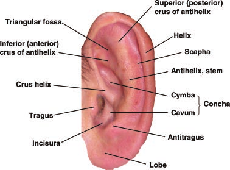

# Morfología Atlas - Extracción de Contenido

## Resumen

He extraído y organizado exitosamente todo el contenido de los PDFs de "Elements of Morphology" para tu aplicación web.

## Contenido Extraído

### Documentos Procesados
- **Total de PDFs**: 22 documentos
- **Textos extraídos**: 16 archivos .txt en `data/`
- **Imágenes extraídas**: 694 imágenes PNG en `images/`
- **Términos morfológicos**: 2,256 términos únicos con definiciones

### Categorías Anatómicas

Los documentos cubren las siguientes regiones anatómicas:

1. **Introducción** (1 doc)
   - Introducción a la terminología morfológica estándar

2. **Cabeza y Cara** (1 doc, 75 imágenes)
   - 254 términos morfológicos

3. **Oído/Oreja** (3 docs, 76 imágenes)
   - 268 términos morfológicos
   - Incluye características adicionales del oído

4. **Región Periorbital** (1 doc, 41 imágenes)
   - 155 términos morfológicos

5. **Nariz y Filtrum** (1 doc, 55 imágenes)
   - 225 términos morfológicos

6. **Labios, Boca y Región Oral** (1 doc, 58 imágenes)
   - 227 términos morfológicos

7. **Dientes** (1 doc, 62 imágenes)
   - 262 términos morfológicos
   - Incluye clasificación de trastornos dentales genéticos

8. **Manos y Pies** (1 doc, 103 imágenes)
   - 403 términos morfológicos

9. **Genitales Externos** (2 docs, 52 imágenes)
   - 337 términos morfológicos

10. **Variaciones Fenotípicas** (3 docs)
    - Terminología general y progreso del proyecto

## Estructura de Archivos

```
morphology-atlas/
├── pdfs/                          # PDFs originales
├── data/                          # Textos extraídos
│   ├── *.txt                      # Texto de cada PDF
│   ├── extraction_metadata.json   # Metadata de extracción
│   └── organized/                 # Contenido organizado
│       ├── content_by_category.json
│       ├── summary.json
│       ├── morphology_terms.json  # Todos los términos
│       ├── terms_by_category.json # Términos por categoría
│       └── terms_index.json       # Índice de términos
├── images/                        # Todas las imágenes extraídas
│   └── *.png                      # Imágenes en formato PNG
└── scripts de extracción/
    ├── extract_pdfs.py            # Extractor de PDFs
    ├── organize_content.py        # Organizador de contenido
    └── extract_terms.py           # Extractor de términos

```

## Archivos de Datos para la Aplicación

### 1. `data/organized/morphology_terms.json`
Contiene todos los términos morfológicos con:
- `term`: Nombre del término
- `definition`: Definición completa
- `category`: Categoría anatómica
- `document`: Documento fuente
- `source`: Archivo fuente

### 2. `data/organized/terms_by_category.json`
Términos organizados por categoría anatómica para navegación fácil.

### 3. `data/organized/content_by_category.json`
Contenido completo organizado por categoría con:
- Títulos de documentos
- Archivos de texto
- Lista de imágenes asociadas
- Conteo de términos encontrados
- Muestra de términos

### 4. `data/organized/summary.json`
Resumen estadístico del contenido extraído.

### 5. `data/extraction_metadata.json`
Metadata de todos los archivos procesados con enlaces a textos e imágenes.

## Imágenes

Todas las imágenes están en formato PNG en el directorio `images/`. Cada imagen tiene un prefijo que indica su documento fuente, por ejemplo:

```
images/elements_of_morphology_standard_terminology_for_the_ear-000.png
images/elements_of_morphology_standard_terminology_for_the_ear-001.png
...
```

## Uso en la Aplicación Web

### Cargar Términos Morfológicos

```javascript
// Ejemplo: Cargar todos los términos
fetch('data/organized/morphology_terms.json')
  .then(response => response.json())
  .then(terms => {
    // terms es un array de objetos con term, definition, category, etc.
    console.log(`Loaded ${terms.length} morphological terms`);
  });
```

### Cargar Términos por Categoría

```javascript
// Ejemplo: Cargar términos de una categoría específica
fetch('data/organized/terms_by_category.json')
  .then(response => response.json())
  .then(categories => {
    const earTerms = categories.ear;
    console.log(`Ear terms: ${earTerms.length}`);
  });
```

### Mostrar Imágenes

```html
<!-- Las imágenes se pueden referenciar directamente -->

```

## Estadísticas Finales

- ✅ **22 documentos** procesados
- ✅ **694 imágenes** extraídas en formato PNG
- ✅ **2,256 términos** morfológicos únicos con definiciones
- ✅ **10 categorías** anatómicas
- ✅ **Datos estructurados** en formato JSON para fácil integración

## Próximos Pasos para la Aplicación Web

1. **Interfaz de Navegación**: Crear menú con las 10 categorías anatómicas
2. **Búsqueda de Términos**: Implementar búsqueda en los 2,256 términos
3. **Visualización de Imágenes**: Galería de imágenes por categoría
4. **Glosario Interactivo**: Mostrar términos con sus definiciones
5. **Filtros**: Por categoría, documento fuente, etc.

## Notas Técnicas

- Todos los textos están en formato UTF-8
- Las imágenes están en PNG de alta calidad
- Los archivos JSON están indentados para legibilidad
- Los nombres de archivos están sanitizados (sin espacios ni caracteres especiales)
- Se han eliminado términos duplicados

## Scripts Disponibles

- `extract_pdfs.py`: Extrae texto e imágenes de PDFs
- `organize_content.py`: Organiza contenido por categorías
- `extract_terms.py`: Extrae términos con definiciones

Todos los scripts son reutilizables si necesitas procesar más PDFs en el futuro.
