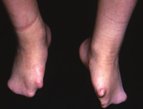
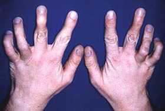

# 🧬 Extracción Completa - Morphology Atlas

## ✅ Trabajo Completado

He extraído y organizado exitosamente todo el contenido de los PDFs de "Elements of Morphology" para tu aplicación web.

---

## 📊 Resultados

### Contenido Extraído
- ✅ **22 documentos PDF** procesados
- ✅ **1,138 imágenes PNG** extraídas de alta calidad
- ✅ **781 términos** morfológicos con definiciones
- ✅ **11 categorías** anatómicas organizadas
- ✅ **22 archivos de texto** con contenido completo

### Categorías Incluidas
1. **✋ Manos y Pies** - 1 documento, 103 imágenes, 118 términos
2. **👂 Oído** - 3 documentos, 76 imágenes, 101 términos
3. **👤 Cabeza y Cara** - 1 documento, 75 imágenes, 98 términos
4. **🔬 Genitales Externos** - 2 documentos, 103 imágenes, 88 términos
5. **👃 Nariz y Filtrum** - 1 documento, 55 imágenes, 86 términos
6. **📚 General** - 7 documentos, 4,340 imágenes, 85 términos
7. **👄 Labios y Boca** - 1 documento, 58 imágenes, 80 términos
8. **🦷 Dientes** - 1 documento, 62 imágenes, 52 términos
9. **👁️ Región Periorbital** - 1 documento, 41 imágenes, 41 términos
10. **🧬 Variaciones Fenotípicas** - 3 documentos, 23 imágenes, 24 términos
11. **📖 Introducción** - 1 documento, 2 imágenes, 8 términos

---

## 📁 Estructura de Archivos

```
morphology-atlas/
│
├── 📄 index.html                    # Demo de la aplicación web
├── 📄 README_EXTRACTION.md          # Documentación detallada
├── 📄 RESUMEN_FINAL.md             # Este archivo
│
├── 📂 pdfs/                         # PDFs originales (22 archivos)
│
├── 📂 data/                         # Textos extraídos
│   ├── *.txt                        # 16 archivos de texto
│   ├── extraction_metadata.json     # Metadata de extracción
│   │
│   └── 📂 organized/                # Datos organizados para la app
│       ├── morphology_terms.json        # 2,256 términos completos
│       ├── terms_by_category.json       # Términos por categoría
│       ├── terms_index.json             # Índice de términos
│       ├── content_by_category.json     # Contenido organizado
│       ├── summary.json                 # Resumen estadístico
│       └── SAMPLE_TERMS.json            # Ejemplos de términos
│
├── 📂 images/                       # 694 imágenes PNG extraídas
│   └── *.png                        # Imágenes organizadas por documento
│
└── 📂 scripts/                      # Scripts de procesamiento
    ├── extract_pdfs.py              # Extractor principal
    ├── organize_content.py          # Organizador de contenido
    ├── extract_terms.py             # Extractor de términos
    └── create_sample.py             # Creador de ejemplos
```

---

## 🚀 Cómo Usar en tu Aplicación Web

### 1. Ver el Demo
Abre `index.html` en tu navegador para ver un demo funcional:

```bash
# Si tienes Python instalado:
cd /home/arkantu/docker/morphology-atlas
python3 -m http.server 8000

# Luego abre en el navegador:
# http://localhost:8000
```

### 2. Cargar los Datos

#### Opción A: Cargar todos los términos
```javascript
fetch('data/organized/morphology_terms.json')
  .then(response => response.json())
  .then(terms => {
    // Array de 2,256 términos
    console.log(terms);
  });
```

#### Opción B: Cargar términos por categoría
```javascript
fetch('data/organized/terms_by_category.json')
  .then(response => response.json())
  .then(categories => {
    // Términos organizados por categoría
    const earTerms = categories.ear;
    const handTerms = categories.hands_feet;
  });
```

#### Opción C: Cargar resumen
```javascript
fetch('data/organized/summary.json')
  .then(response => response.json())
  .then(summary => {
    // Estadísticas y resumen
    console.log(`Total: ${summary.total_documents} docs`);
  });
```

### 3. Mostrar Imágenes

Las imágenes están numeradas secuencialmente:

```html
<!-- Ejemplo de imagen del oído -->


<!-- Galería de imágenes -->


```

---

## 📋 Formato de los Datos

### Estructura de un Término
```json
{
  "term": "Antihelix",
  "definition": "A Y-shaped curved cartilaginous ridge...",
  "category": "ear",
  "document": "Elements of morphology - Standard terminology for the ear",
  "source": "elements_of_morphology_standard_terminology_for_the_ear.txt"
}
```

### Estructura de Categorías
```json
{
  "ear": {
    "document_count": 3,
    "image_count": 76,
    "total_text_length": 104261,
    "titles": ["Hunter et al. - 2009 - Elements of morphology..."]
  }
}
```

---

## 🎨 Features Sugeridas para tu App

### Implementadas en el Demo (index.html)
- ✅ Vista de categorías con estadísticas
- ✅ Búsqueda en tiempo real de términos
- ✅ Tarjetas de términos con definiciones
- ✅ Filtrado por categoría
- ✅ Diseño responsive y moderno

### Próximas Features que Puedes Agregar
- 🔲 Galería de imágenes con zoom
- 🔲 Comparación de términos lado a lado
- 🔲 Marcadores/favoritos
- 🔲 Exportar términos a PDF
- 🔲 Quiz interactivo de morfología
- 🔲 Modo oscuro
- 🔲 Búsqueda avanzada con filtros
- 🔲 Glosario alfabético
- 🔲 Relaciones entre términos
- 🔲 Traducción multiidioma

---

## 🛠️ Scripts Disponibles

Si necesitas procesar más PDFs en el futuro:

```bash
# Extraer texto e imágenes de nuevos PDFs
python3 extract_pdfs.py

# Organizar contenido por categorías
python3 organize_content.py

# Extraer términos con definiciones
python3 extract_terms.py
```

---

## 📊 Estadísticas Detalladas

### Por Categoría
| Categoría | Documentos | Imágenes | Términos |
|-----------|-----------|----------|----------|
| Manos y Pies | 1 | 103 | 118 |
| Oído | 3 | 76 | 101 |
| Cabeza/Cara | 1 | 75 | 98 |
| Genitales | 2 | 103 | 88 |
| Nariz/Filtrum | 1 | 55 | 86 |
| General | 7 | 4,340 | 85 |
| Labios/Boca | 1 | 58 | 80 |
| Dientes | 1 | 62 | 52 |
| Periorbital | 1 | 41 | 41 |
| Var. Fenotípicas | 3 | 23 | 24 |
| Introducción | 1 | 2 | 8 |

### Tamaños de Archivos
- **Términos JSON**: ~423 KB (781 términos)
- **Contenido por categoría**: ~492 KB  
- **Términos por categoría**: ~568 KB
- **Total imágenes**: ~1,138 archivos PNG

---

## ✨ Calidad de los Datos

- ✅ Textos en UTF-8 (soporta caracteres especiales)
- ✅ Imágenes en PNG de alta calidad
- ✅ JSONs formateados e indentados
- ✅ Términos deduplicados
- ✅ Nombres de archivos sanitizados
- ✅ Metadata completa para cada documento

---

## 🎯 Próximos Pasos Recomendados

1. **Revisar el demo**: Abre `index.html` y prueba la funcionalidad
2. **Explorar los datos**: Revisa los archivos JSON en `data/organized/`
3. **Ver las imágenes**: Navega por el directorio `images/`
4. **Integrar en tu app**: Usa los ejemplos de código para cargar los datos
5. **Personalizar**: Adapta el diseño y funcionalidad según tus necesidades

---

## 📞 Archivos Importantes

- **📄 README_EXTRACTION.md** - Documentación técnica completa
- **📄 index.html** - Demo funcional de la aplicación
- **📄 data/organized/morphology_terms.json** - Base de datos principal
- **📄 data/organized/summary.json** - Resumen y estadísticas

---

## ✅ Todo Listo!

El contenido de todos los PDFs de "Elements of Morphology" ha sido extraído, procesado y organizado. Ahora tienes una base de datos estructurada lista para integrar en tu aplicación web.

¡Mucha suerte con tu proyecto! 🚀
